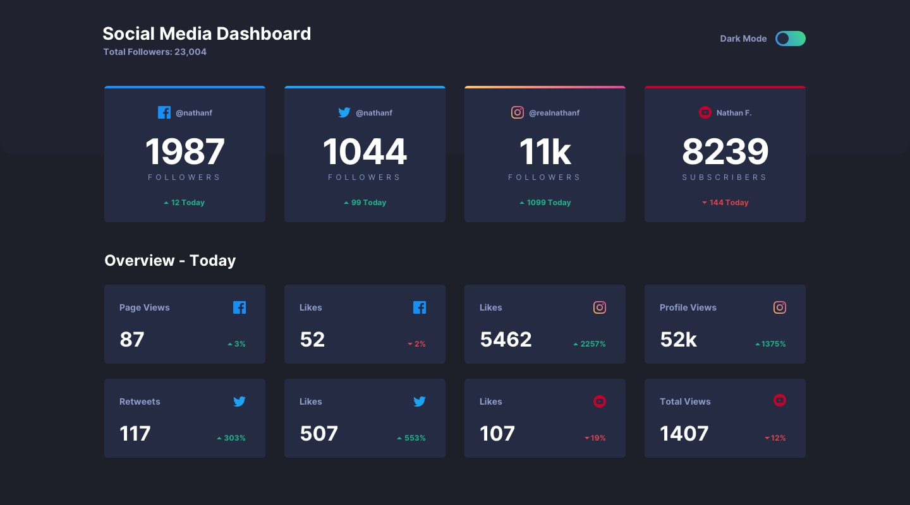
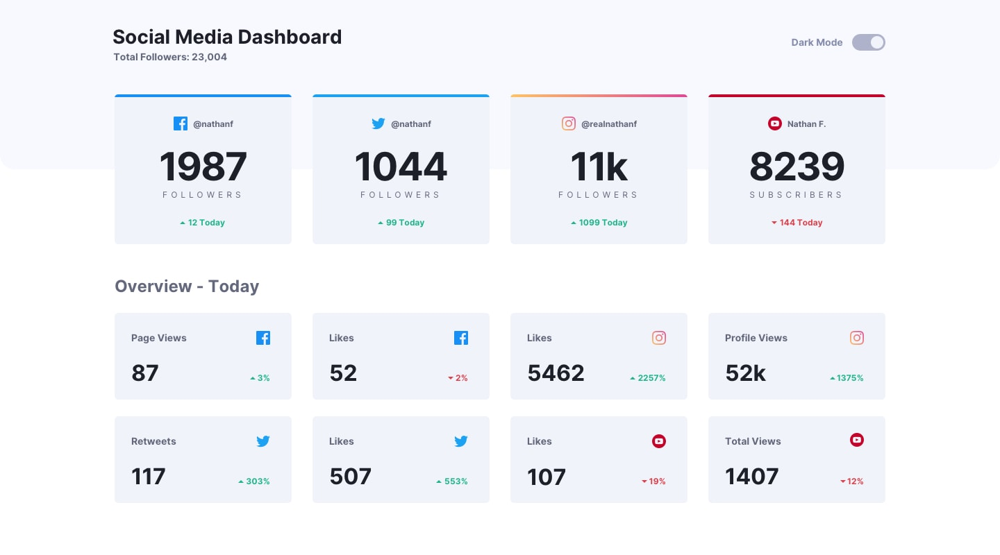

# 📊 Social Media Dashboard with Theme Switcher

Un tableau de bord responsive pour réseaux sociaux (Facebook, Twitter, Instagram, YouTube) intégrant un sélecteur de mode sombre / clair persistant et des animations de compteurs fluides.

Inspiré du défi [Frontend Mentor](https://www.frontendmentor.io/challenges/social-media-dashboard-with-theme-switcher-6oY8ozp_H).

---

## 🚀 Démo & Aperçus

| Mode Sombre | Mode Clair |
| :---: | :---: |
|  |  |

*(D'autres captures d'écran mobiles et d'états actifs sont disponibles dans le dossier [`Screen/`](Screen/))*

---

## ✨ Fonctionnalités

- **Thème Sombre / Clair persistant** :
  - Détection automatique de la préférence système (`prefers-color-scheme`).
  - Sauvegarde du choix utilisateur dans le `localStorage`.
  - Bascule fluide avec un switch animé.
- **Grille responsive** :
  - S'adapte de 1 colonne (mobile) à 2 colonnes (tablette) et 4 colonnes (desktop).
- **Animations de compteurs fluides** :
  - Réalisées avec CSS moderne (`@property --num`, `@keyframes` et `counter-reset`) sans alourdir le bundle JavaScript.
- **Composants modulaires et typés visuellement** :
  - `FollowerCard` : cartes principales avec bordure supérieure aux couleurs de la marque (Facebook, Twitter, Instagram gradient, YouTube).
  - `OverviewCard` : indicateurs quotidiens avec chevrons d'évolution positifs ou négatifs.
  - Composants SVG pour les icônes de réseaux sociaux et chevrons.

---

## 🛠️ Technologies Utilisées

- **[React 19](https://react.dev/)** : Bibliothèque front-end pour la composition des composants.
- **[Tailwind CSS v4](https://tailwindcss.com/)** : Framework CSS utilitaire configuré via `@theme` et `@utility`.
- **[Vite](https://vitejs.dev/)** : Outil de build et serveur de développement ultra-rapide.
- **CSS Houdini (`@property`)** : Pour animer des valeurs numériques de manière native et performante.

---

## 📂 Structure du Projet

```text
react-tailwind/
├── public/                # Favicon et assets statiques
├── Screen/                # Maquettes et captures d'écran de référence
├── src/
│   ├── assets/            # Fichiers SVG originaux
│   ├── components/        # Composants réutilisables
│   │   ├── icons/         # Composants SVG React (Facebook, Twitter, etc.)
│   │   ├── follower_card.jsx  # Carte principale de followers
│   │   └── overview_card.jsx  # Carte statistique du jour
│   ├── utils/             # Fonctions utilitaires (parseurs de données, helpers)
│   ├── App.jsx            # Composant racine avec gestion du thème
│   ├── data.js            # Données mockées des métriques sociales
│   ├── index.css          # Thème Tailwind v4, variables CSS & animations
│   └── main.jsx           # Point d'entrée de l'application
├── package.json
└── vite.config.js
```

---

## 💻 Installation et Démarrage

### Prérequis

- [Node.js](https://nodejs.org/) (version 18+ recommandée)
- `npm` ou tout gestionnaire de paquets équivalent (`pnpm`, `yarn`)

### 1. Cloner le dépôt

```bash
git clone https://github.com/Ethan-Lochis/R505-Springinsfeld.git
cd react-tailwind
```

### 2. Installer les dépendances

```bash
npm install
```

### 3. Lancer le serveur de développement

```bash
npm run dev
```

L'application sera accessible par défaut à l'adresse `http://localhost:5173`.

### 4. Construire pour la production

```bash
npm run build
```

Pour prévisualiser le build de production :

```bash
npm run preview
```

---

## 📝 Auteur

- Développé par **Ethan Lochis**
- Dépôt : [Ethan-Lochis/R505-Springinsfeld](https://github.com/Ethan-Lochis/R505-Springinsfeld)
